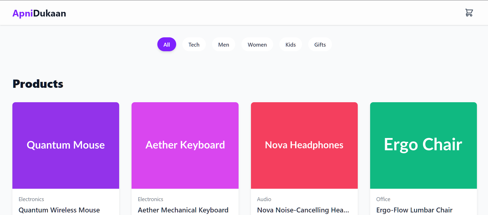

# ApniDukaan - A Modern E-commerce Web App

Welcome to **ApniDukaan**!  
This is a fully functional, single-file e-commerce application built with modern web technologies. It provides a clean, fast, and highly interactive shopping experience — perfect for a personal project or as a template for a larger application.

---

## ✨ Features
- **Dynamic Product Catalog** – Displays a grid of products fetched from a local data source.  
- **Category Filtering** – Smooth filtering by category (`All, Tech, Men, Women, Kids, Gifts`) with fluid animations.  
- **Interactive Product Cards** – Subtle hover effects for engaging user interactions.  
- **Slide-In Shopping Cart** – A sleek, animated sidebar cart to view, update, and remove items without leaving the page.  
- **State Management with React Hooks** – Efficient cart state handling with `useState`.  
- **Toast Notifications** – Non-intrusive alerts for adding/removing items.  
- **Fully Responsive** – Optimized for mobile, tablet, and desktop.  
- **Built-in SVG Icons** – Fast and dependency-free icons included as React components.  

---

## 🚀 Tech Stack
- **React** – Component-based UI  
- **Tailwind CSS** – Utility-first styling  
- **Framer Motion** – Smooth animations  

---

